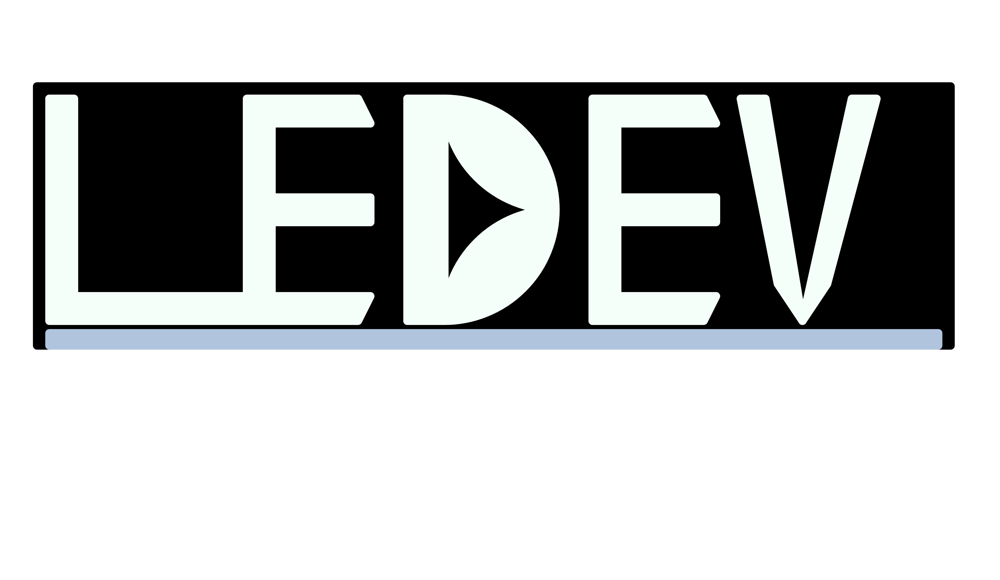

<html>
<head>
<link rel="stylesheet" href="https://unpkg.com/tachyons/css/tachyons.min.css">
</head>

<article class="cf">
  <header class="fn fl-ns w-50-ns pr4-ns">
    <h1 class="f2 lh-title fw9 mb3 mt0 pt3 bt bw2">
      About Me
    </h1>
    <h2 class="f2 mid-gray lh-title">
      Full Stack Developer, Functional Programmer, hobbyist mathematician, physicist, into systems.
    </h2>
  </header>
  

    

      I'm Lorenzo, and below you'll find a bit more about me, and my journey as a software engineer.
    

    
Welcome to my GitHub

    

      I got my start in my spare time, circa 2017, after realizing that I could transfer my understanding of computers from audio-engineering, into other technical fields. I spent a little over a year, self learning, and realized that I needed structure and guidance, which I received at <a href="https://lambdaschool.com/courses/full-stack-web-development">Lambda</a>. Having <a href="https://www.youracclaim.com/badges/179968c7-0dd9-473c-bdbd-34919b83d33b/public_url">completed the course</a>, I've grown the horizons of my learning massively, branching out into <a href="https://lambdaschool.com/courses/data-science">Data Science</a> and <a>Analysis</a>, <a href="https://www.synthsforcompilers.dev/mathematics/2020/may/math-post-0/">Mathematics</a>, and(<a href="https://nextjournal.com/0xledev/computing-galactic-orbits-with-astropy-a-data-driven-ride-through-the-cosmos">Astro</a>) <a href="https://www.synthsforcompilers.dev/physics/2020/july/hidden-rules-physics/">Physics, <a href="https://twitter.com/TheOlympiAcad">as well as co-running a community</a> of fellow autodidact Physics enthusiasts.</a>
      
In addition to that, I've moved into the world of cloud computing, becoming a certified <a href="https://www.youracclaim.com/badges/4582280c-e647-4665-b2f3-d34d9a83833b/public_url">AWS Cloud Practitioner</a>, you can take a look at my study notes <a href="https://0xledev.roaman.pub/pages/__Cloud-Practitioner__.html">here</a> if you'd like.

  Projects:
  <ul>
    <li><a href="https://github.com/LorenzoEvans/kurogane_os">Kurogane OS</a></li>
    <li><a href="https://github.com/LorenzoEvans/ai10cle-api">ai10cle-api</a></li>
  </ul>

 

<a href="https://www.linkedin.com/in/lorev" style="padding-bottom:10px;">
 LinkedIn
</a>
</html>

  

</article>

<!--
**LorenzoEvans/LorenzoEvans** is a ✨ _special_ ✨ repository because its `README.md` (this file) appears on your GitHub profile.
-->

