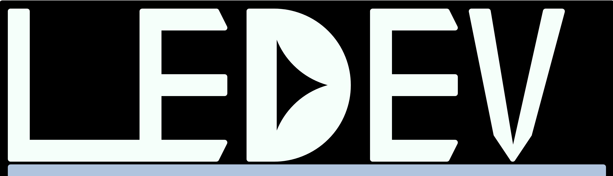

<html>
<head>
<link rel="stylesheet" href="https://unpkg.com/tachyons/css/tachyons.min.css">
</head>

<article class="cf">
  <header class="fn fl-ns w-50-ns pr4-ns">
    <h1 class="f2 lh-title fw9 mb3 mt0 pt3 bt bw2">
      About Me
    </h1>
  </header>
  

    

      I'm Lorenzo, and below you'll find a bit more about me, and my journey as a software engineer.
    

I'm a software developer with a background in audio engineering, focusing on Rust and systems programming. My journey from artist to technologist has shaped my approach to problem-solving and software design.

This transition was a mix of chance interactions and calculated leaps into the unknown.

Rust is my tool of choice, because it's a philosophy and principles regarding memory safety and precision mirror the process of audio engineering in way that resonates with me.

> "The programmer, like the poet, works only slightly removed from pure thought-stuff. He builds his castles in the air, from air, creating by exertion of the imagination." - Frederick P. Brooks

   

  Projects:
  <ul>
    <li><a href="https://nextjournal.com/0xledev/computing-galactic-orbits-with-astropy-a-data-driven-ride-through-the-cosmos">Computing Galactic Orbits In Astropy</a></li>
    <li><a href="https://github.com/LorenzoEvans/chemicli">Chemicli</a></li>
    <li><a href="https://github.com/LorenzoEvans/tapehead">Tapehead</a></li>
    <li><a href="https://github.com/LorenzoEvans/filemanager">Filemanager</a></li>
    <li><a href="https://github.com/LorenzoEvans/soundry">Soundry</a></li>
    <li><a href="https://github.com/LorenzoEvans/envelope">Envelope</a></li>
      <li><a href="https://github.com/LorenzoEvans/amixima">Amixima</a></li>
  </ul>
   </ul>

 

</html>
<a href="https://www.linkedin.com/in/lorev" style="padding-bottom:10px;">
 LinkedIn
</a>
<a href="https://lorenzoevans.herokuapp.com/" style="padding-bottom:10px;">
 Portfolio

  

</article>

<!--
**LorenzoEvans/LorenzoEvans** is a ✨ _special_ ✨ repository because its `README.md` (this file) appears on your GitHub profile.
-->

